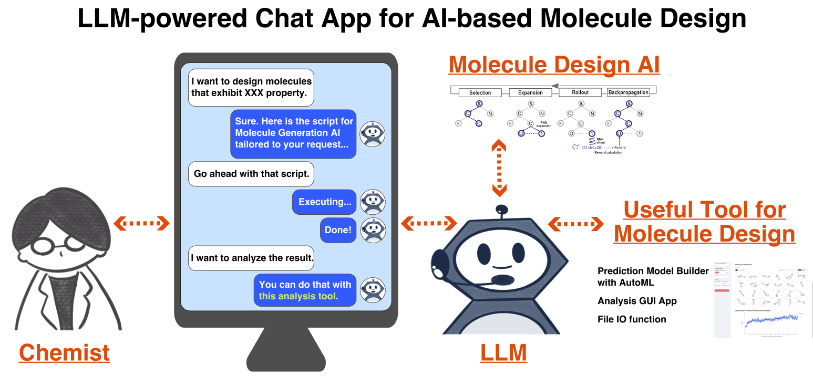

# Welcome to ChatChemTS!

ChatChemTS helps users to design molecules using AI-based molecule generator, ChemTSv2, via only chat interactions. 
Four main operations are supported: reward function design, configuration setup, execution of a molecule generator, and analysis of the result. 



## Chat Demonstration

Be sure to enter one-line at a time.

### STEP 1. Generate reward file

#### reward function without prediction model

```text
I want to design molecules with a LogP value of 5.0.
Save the above reward script as `reward_test.py`.
```

#### reward function with prediction model

```text
I want to create a prediction model using my own dataset.
# Assuming the output file name of the created prediction model is `flaml_model_test.pkl`.
I want to design molecules with [YOUR_SPECIFIED_PROPERTY]. Use the prediction model named `flaml_model_test.pkl` to estimate [YOUR_SPECIFIED_PROPERTY].
Save the above reward script as `reward_test.py`.
```

### STEP 2. Configuration generation

```text
Write a config file to generate 500 molecules using the reward file, `reward_test.py` with SAscore filter set to 5.0. Output directory is set to `output_test`.
Save the above configuration as `config_test.yaml`.
```

Supported filter functions in ChemTSv2 are described [here](https://github.com/molecule-generator-collection/ChemTSv2/tree/master/filter). 

### STEP 3. Run molecule generator

```text
Run ChemTSv2 using `config_test.yaml`.
```

### STEP 4. Analyze retult

```text
I want to analyze the molecule generation result.
```

## Available tools

When using ChatChemTS, you don't need to understand the following functions, but ChatChemTS uses them to enhance your molecule generation experience.

- `reward_generator` creates a reward script for AI-based molecule generators.
- `config_generator` creates a configuration for AI-based molecule generators.
- `chemtsv2_api` runs ChemTSv2 application using the provided configuration file.
- `flaml_prediction_model_builder` supports users to build prediction models using AutoML tool, FLAML.
- `analysis_tool` provides an analysis application to analyze the molecule generation result.
- `write_file_tool` provides a function to write a file.
